<h1 align="center">D.A.N.C.E. School Redesign</h1>
<p align="center">
  Made with <code>HTML</code>, <code>CSS</code>, <code>TypeScript</code>, <code>ReactJS</code>, <code>TailwindCSS</code>
  <br>
  Bootstrapped with <code>Create Next App</code>
</p>

<p align="center">
  <a href="../../actions"></a>
  <a href="../../commits"></a>
  <a href="./LICENSE"></a>
  
  
</p>

<p align="center">
  <a href="#-screenshots">🖼 Screenshots</a> • 
  <a href="#ℹ%EF%B8%8F-about">ℹ️ About</a> • 
  <a href="#%EF%B8%8F-tools">⚙️ Tools</a> • 
  <a href="#-build-project">🔨 How to Build Project</a> • 
  <a href="#-file-structure">📁 File Structure</a>
</p>

<sup>
  <p align="center">
    <a href="#-npm-packages-worth-mentioning">📦 NPM Packages worth mentioning</a> • 
    <a href="#-details">💡 Details</a> • 
    <a href="#-useful-resources">🔗 Useful resources</a> • 
    <a href="#-author">👤 Author</a>
  </p>
</sup>

## 🖼 Screenshots

<p align="center">
  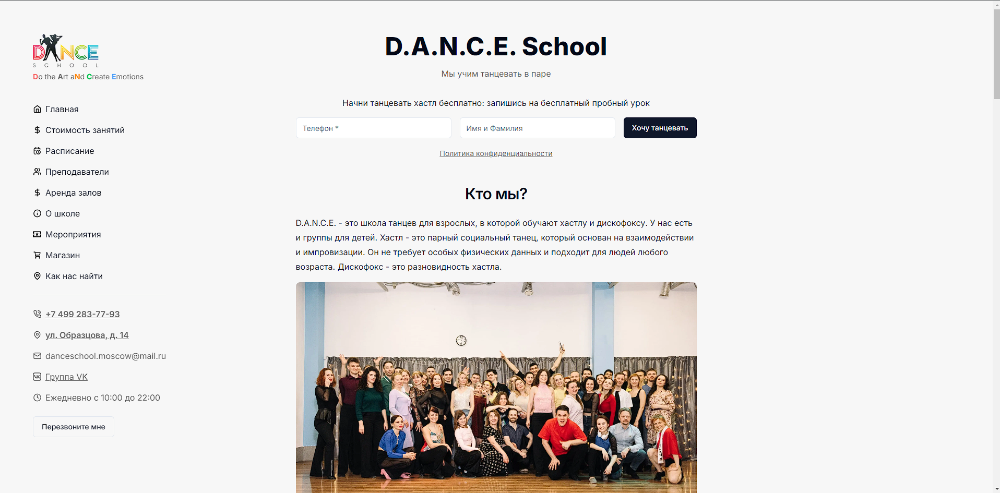
</p>

<p align="center">
  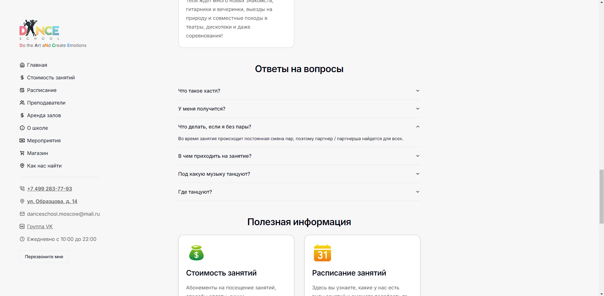
</p>

<p align="center">
  
</p>

<p align="center">
  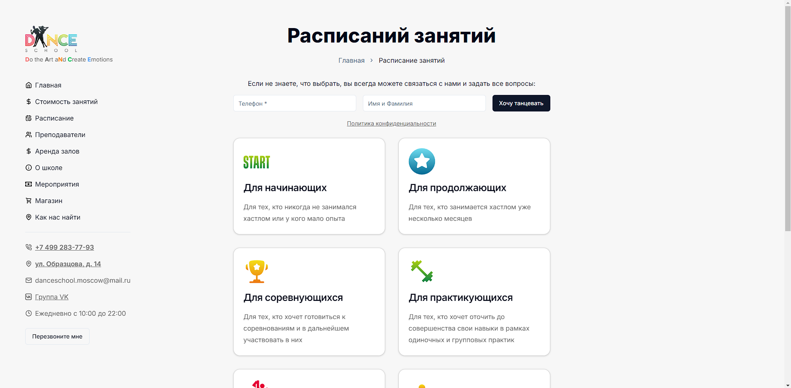
</p>

<p align="center">
  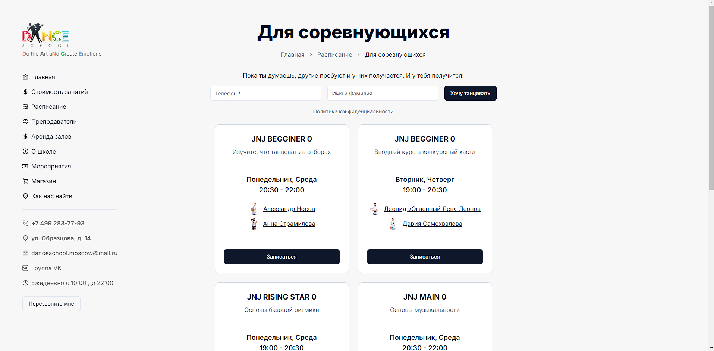
</p>

<p align="center">
  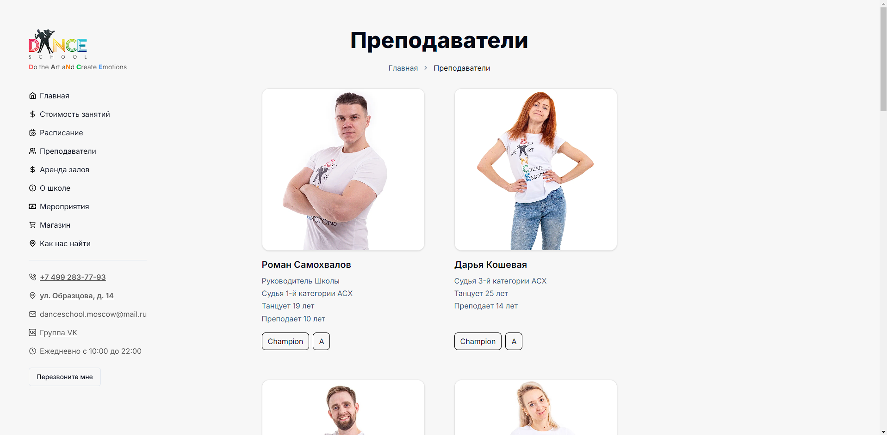
</p>

<p align="center">
  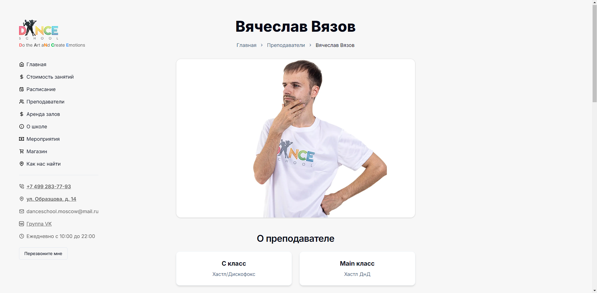
</p>

<p align="center">
  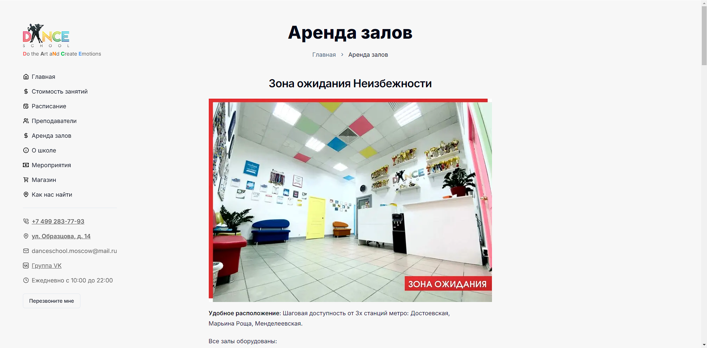
</p>

<p align="center">
  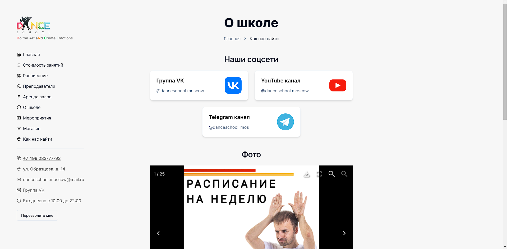
</p>

<p align="center">
  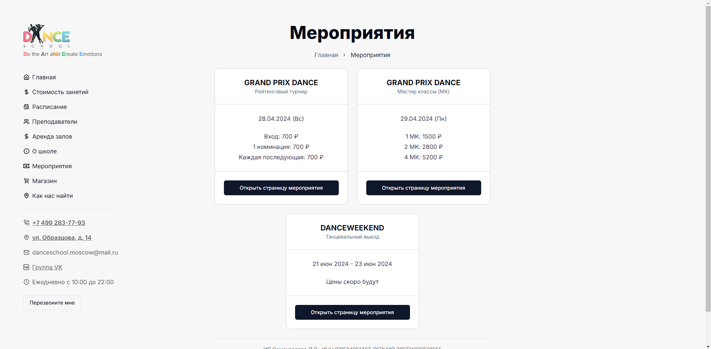
</p>

<p align="center">
  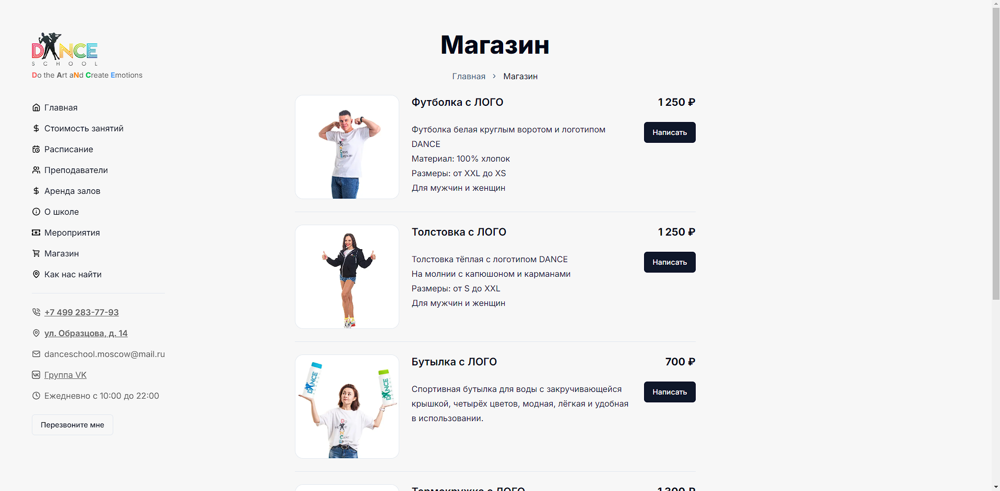
</p>

<p align="center">
  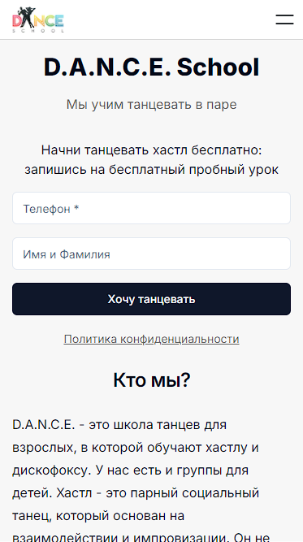
  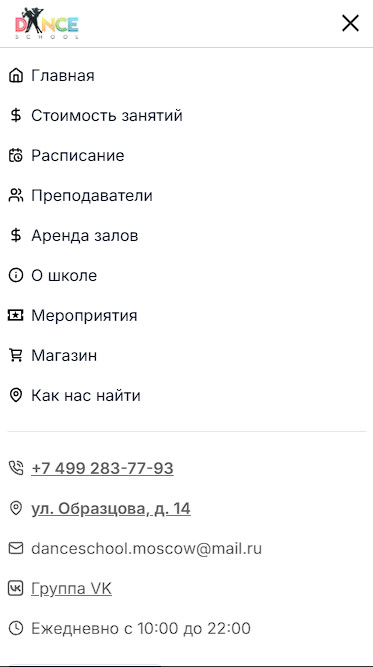
</p>

<p align="center">
  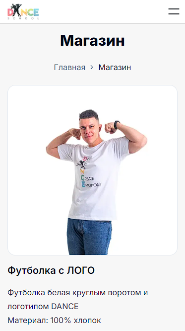
</p>

Also I significantly optimized the site:

The performance of my site: https://pagespeed.web.dev/analysis/https-dance-school-moscow-vercel-app/eb21uy6l9z?form_factor=mobile&hl=en

<p align="center">
  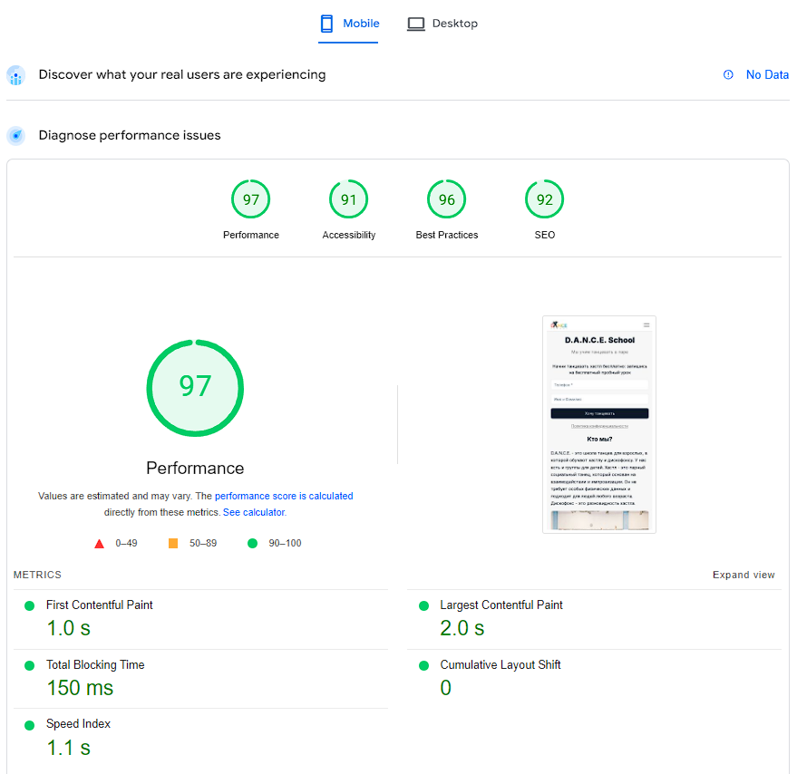
</p>

<p align="center">
  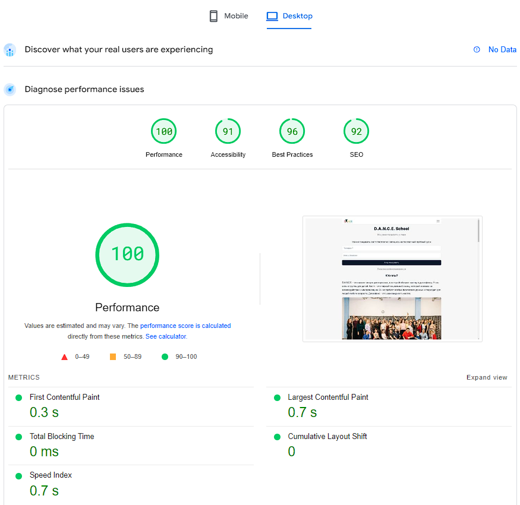
</p>

The performance of the old site: https://pagespeed.web.dev/analysis/https-danceschool-moscow/4c6sxfv3ke?form_factor=mobile%3Fhl%3Den&hl=en

<p align="center">
  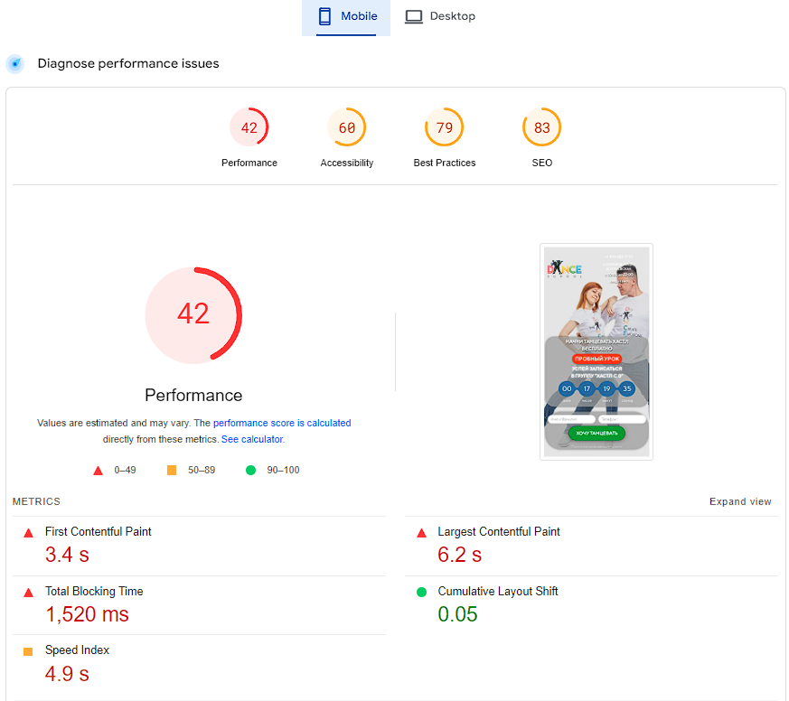
</p>

<p align="center">
  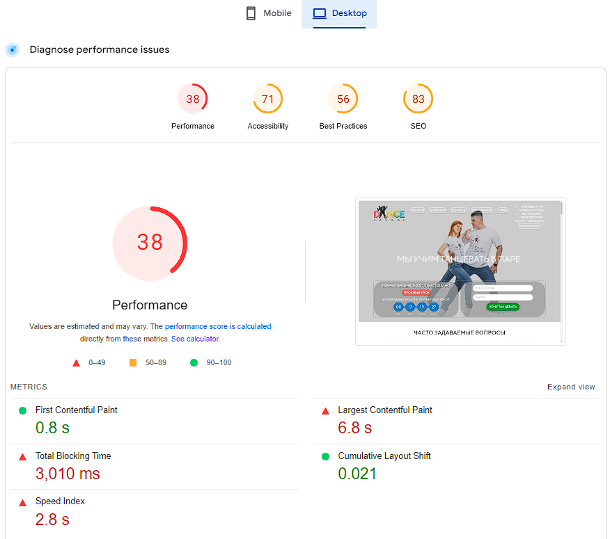
</p>

## ℹ️ About

I studied dances in D.A.N.C.E. school. When I saw their site I thought that there is some space for improvement.

The original site looks like that: https://danceschool.moscow/

<p align="center">
  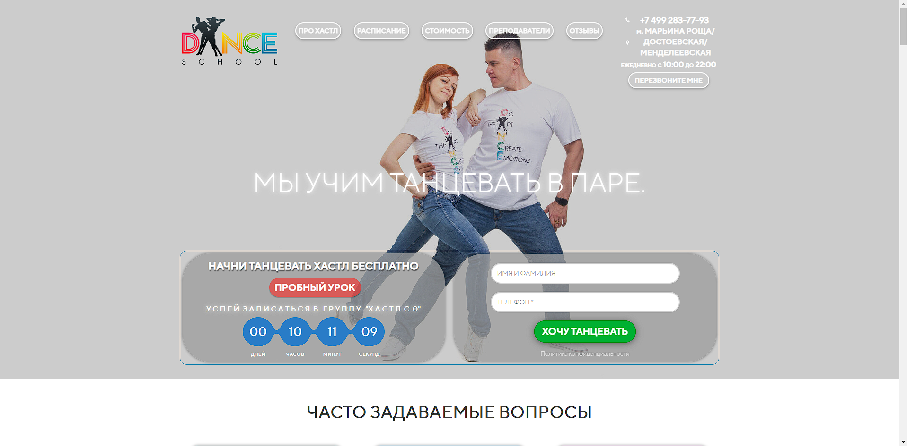
</p>

Thus I made a new design from scratch and implemented it.

The main goal of the project is to demonstrate my skills in NextJS, TailwindCSS. Also I wanted to try out the ShadcnUI library

## ⚙️ Tools

- **HTML5**
- **CSS**
  - TailwindCSS
- **TypeScript**
  - ReactJS
  - NextJS
  - ShadcnUI
- **Vercel**

## 🔨 Build project

<table>
  <tr>
    <th>Command</th>
    <th>Description</th>
  </tr>
  <tr>
    <td><code>npm&nbsp;i</code></td>
    <td>First things first, install all required packages</td>
  </tr>
  <tr>
    <td><code>npm&nbsp;run&nbsp;dev</code></td>
    <td>Run the app in development mode</td>
  </tr>
  <tr>
    <td><code>npm&nbsp;run&nbsp;build</code></td>
    <td>Build the app</td>
  </tr>
  <tr>
    <td><code>npm&nbsp;run&nbsp;start</code></td>
    <td>Run the app in production mode</td>
  </tr>
  <tr>
    <td><code>npm&nbsp;run&nbsp;lint</code></td>
    <td>Check compliance with Eslint rules</td>
  </tr>
  <tr>
    <td><code>npm&nbsp;run&nbsp;test</code></td>
    <td>Run unit tests</td>
  </tr>
</table>

## 📁 File Structure

```Markdown
|
├── 📁 public                 Static assets
|
├── 📁 screenshots            App screenshots
|
├── 📁 src                    Source code of the app
|   |
│   ├── 📁 app                NextJS pages (routing)
|   |   |
|   |   ├── 📁 PageName
|   |   |   ├── 📝 page.tsx            Page logic
|   |   |   ├── 📝 page.types.tsx      (optional) Page types
|   |   |   ├── 📝 hooks.tsx           (optional) Custom react hooks
|   |   |   ├── 📝 utils.ts            (optional) Custom utility functions
|   |   |   └── 📝 other files         Other additional files
|   |   |
│   |   ├── 📝 globals.scss            Global styles
│   |   ├── 📝 icon.png                Favicon
│   |   ├── 📝 layout.tsx              Root app layout
│   |   └── 📝 page.tsx                Root page
|   |
│   ├── 📁 components                  React components
|   |   |
│   |   ├── 📝 ComponentName.tsx       Component logic and styles
|   |   |
|   |   ├── 📁 svg                     Svg icons imported in the app
|   |   |
|   |   └── 📁 ComponentName
|   |       ├── 📝 index.tsx           Component logic
|   |       ├── 📝 index.module.css   (optional) Component styles
|   |       ├── 📝 index.types.tsx     (optional) Component types
|   |       ├── 📝 hooks.tsx           (optional) Custom hooks used only in this component
|   |       ├── 📝 utils.ts            (optional) Custom utility functions used only in this component
|   |       └── 📝 other files         Other additional files
|   |
│   ├── 📁 data                        Code responsible for providing data to display on the pages
|   |
│   ├── 📁 lib
│   |   ├── 📁 hooks                   Custom React hooks
|   |   ├── 📝 utils.test.ts           Unit tests
|   |   └── 📝 utils.ts                Utility functions
|   |
|   |
│   ├── 📝 globals.scss       Global styles
│   ├── 📝 index.html         Root HTML file
│   ├── 📝 index.tsx          Entry point for the module bundler
│   └── 📝 vite-end.d.ts      Some Typescript stuff for Vite
|
├── 📝 .eslintrc.cjs          ESLint configuration file
├── 📝 .gitignore             Instructions for Git about what files to ignore
├── 📝 .prettierrc            Prettier configuration file
├── 📝 components.json        (automatically generated) Config file for ShadcnUI components
├── 📝 LICENSE                MIT License. Basically you can do whatever you want with the code
├── 📝 next.config.mjs        NextJS config file
├── 📝 package-lock.json      Keeps track of the exact version of every package that is installed
├── 📝 package.json           Various metadata relevant to the project, scripts, dependencies
├── 📝 postcss.config.mjs     PostCSS config file (for TailwindCSS)
├── 📝 README.md              Project description
├── 📝 svgr.d.ts              Types required for using .svg files as React components
├── 📝 taildwind.config.ts    TailwindCSS config file
└── 📝 tsconfig.json          TypeScript configuration file
```

## 📦 NPM Packages worth mentioning

- `swiper` - library that I used for displaying iframes in a carousel
- `yet-another-react-lightbox` - used to display image galleries in a carousel
- `vitest` - unit tests

## 💡 Details

### Design

The most of efforts was dedicated to creating a prototype in Figma. It was quite a challenge to come up with a proper design that would feasible, yet nice looking.

Here is the prototype: https://www.figma.com/design/RNcFcOtzYXltCOzdM1dqKr/DANCE-School?node-id=0-1&t=omUocB5RXLxJ4pVq-1

### TailwindCSS

Not a big fan of it. Initially thought that if I make a big project with TailwindCSS I would change my mind about it. No, I still don't understand the big hype around it

Just look at that:

```tsx
<nav
  className={cn(
    'fixed top-16 z-10 max-h-screen',
    'mobile:left-1/2 mobile:top-0 mobile:w-[min(100%,var(--standard-width))] mobile:-translate-x-1/2 mobile:bg-white',
    'desktop:left-16 desktop:max-h-[calc(100vh-4rem)]'
  )}
>
```

I don't like when styles are mixed with page logic. CSS Modules is still the best solution for me, so far.

Advantages:

- Less style files in the app
- I didn't have to think about naming classes (although it wasn't a problem for me)
- Was able to use ShadcnUI (it works only with TailwindCSS)

Disadvantages:

- Unintuitive syntax: I had to often look in the cheat sheet
- Hard to read: plain CSS is so much more comfortable to read
- Messy code: from time to time I had to figure out what element on screen that was

Tailwind might be nice for smaller projects, but I wouldn't recommend to use it on big projects

### Markdown Typography

https://github.com/tailwindlabs/tailwindcss-typography - Typography in TailwindCSS for Markdown

```tsx
<Markdown className="prose mt-4">{trainer.markDownPageDescription}</Markdown>
```

### Svgr

See: https://react-svgr.com/docs/next/#typescript

Helps to turn svg into React Components

Add `svgr.d.ts` in the root:

```ts
declare module '*.svg' {
  import { FC, SVGProps } from 'react'
  const content: FC<SVGProps<SVGElement>>
  export default content
}

declare module '*.svg?url' {
  const content: any
  export default content
}
```

Then you can import them like that:

```tsx
import PartyIcon from '@/components/svg/icons_small/party.svg'
```

## 🔗 Useful resources

n/a
